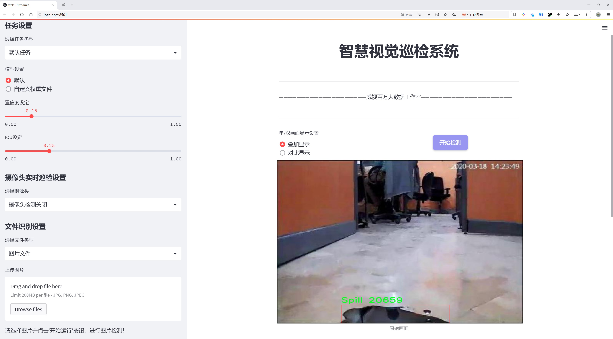
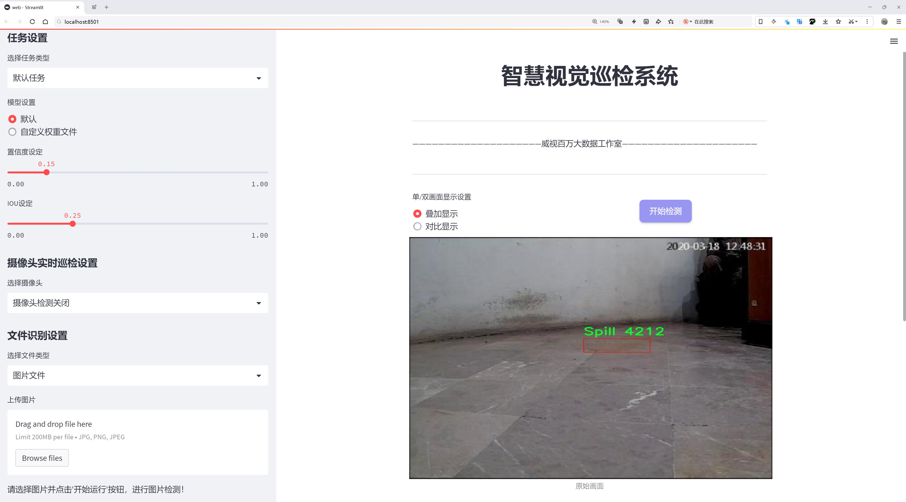
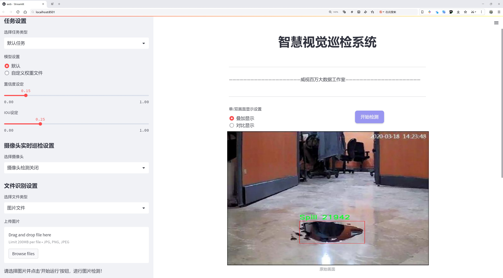
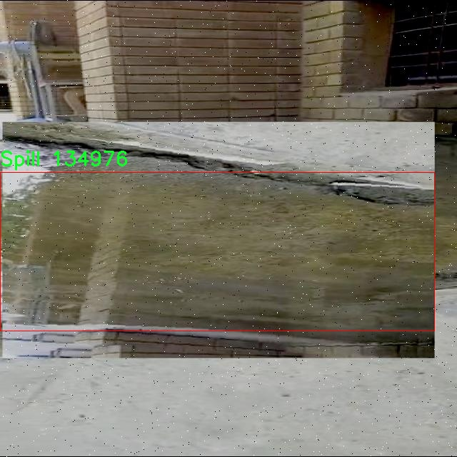
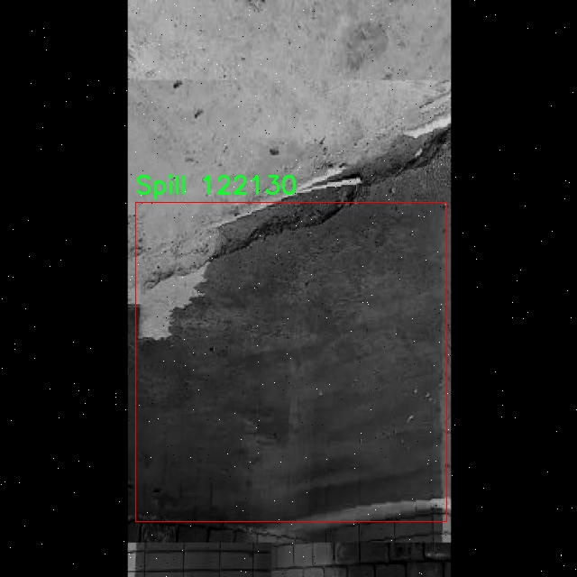
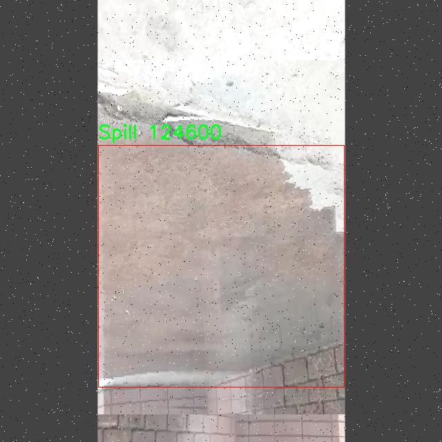
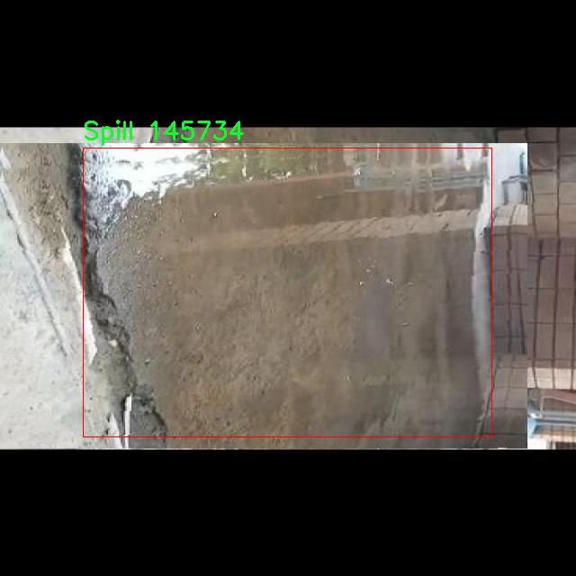
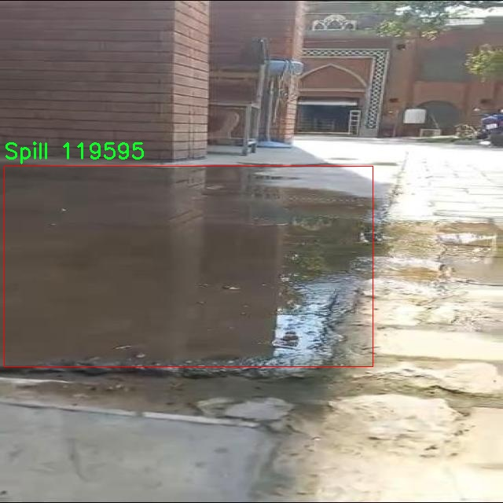

# 液体泄漏泼溅检测检测系统源码分享
 # [一条龙教学YOLOV8标注好的数据集一键训练_70+全套改进创新点发刊_Web前端展示]

### 1.研究背景与意义

项目参考[AAAI Association for the Advancement of Artificial Intelligence](https://gitee.com/qunmasj/projects)

项目来源[AACV Association for the Advancement of Computer Vision](https://kdocs.cn/l/cszuIiCKVNis)

研究背景与意义

随着工业化进程的加快，液体泄漏问题日益严重，尤其是在化工、石油和食品等行业，液体泄漏不仅会造成经济损失，还可能对环境和人类健康造成严重威胁。因此，及时、准确地检测液体泄漏及其泼溅现象，成为了保障生产安全和环境保护的重要任务。传统的液体泄漏检测方法多依赖人工监测和简单的传感器，这些方法不仅效率低下，而且容易受到人为因素的影响，导致漏检或误检的情况发生。为了解决这一问题，基于计算机视觉的自动化检测系统逐渐成为研究的热点。

近年来，深度学习技术的快速发展为目标检测领域带来了革命性的变化。YOLO（You Only Look Once）系列模型因其高效的实时检测能力和较高的准确率，广泛应用于各种物体检测任务中。YOLOv8作为该系列的最新版本，进一步提升了模型的性能和适用性。然而，针对液体泄漏泼溅的特定场景，YOLOv8仍然面临着一些挑战，如背景复杂性、液体形态多样性以及光照变化等。因此，改进YOLOv8模型以适应液体泄漏检测的需求，具有重要的研究意义。

本研究基于改进YOLOv8模型，构建了一套液体泄漏泼溅检测系统。该系统的核心在于利用3200张标注图像的数据集，专注于液体泼溅这一特定类别。通过对数据集的深入分析和处理，我们可以提取出液体泄漏的特征信息，并通过模型训练提高检测的准确性和鲁棒性。此外，改进的YOLOv8模型能够在保持高效检测速度的同时，增强对液体泄漏特征的识别能力，从而实现实时监测和预警。

本研究的意义不仅在于技术层面的创新，更在于其对实际应用的推动。通过构建高效的液体泄漏检测系统，可以显著降低人工监测的成本，提高液体泄漏事件的响应速度，进而减少潜在的经济损失和环境污染。同时，该系统的成功应用还可以为其他领域的目标检测提供借鉴，推动深度学习技术在工业安全、环境监测等方面的广泛应用。

综上所述，基于改进YOLOv8的液体泄漏泼溅检测系统的研究，不仅填补了现有技术在液体泄漏检测领域的空白，也为相关行业提供了切实可行的解决方案，具有重要的理论价值和实际意义。通过不断优化和完善该系统，未来有望在更广泛的场景中实现高效、准确的液体泄漏监测，为安全生产和环境保护贡献力量。

### 2.图片演示







##### 注意：由于此博客编辑较早，上面“2.图片演示”和“3.视频演示”展示的系统图片或者视频可能为老版本，新版本在老版本的基础上升级如下：（实际效果以升级的新版本为准）

  （1）适配了YOLOV8的“目标检测”模型和“实例分割”模型，通过加载相应的权重（.pt）文件即可自适应加载模型。

  （2）支持“图片识别”、“视频识别”、“摄像头实时识别”三种识别模式。

  （3）支持“图片识别”、“视频识别”、“摄像头实时识别”三种识别结果保存导出，解决手动导出（容易卡顿出现爆内存）存在的问题，识别完自动保存结果并导出到tempDir中。

  （4）支持Web前端系统中的标题、背景图等自定义修改，后面提供修改教程。

  另外本项目提供训练的数据集和训练教程,暂不提供权重文件（best.pt）,需要您按照教程进行训练后实现图片演示和Web前端界面演示的效果。

### 3.视频演示

[3.1 视频演示](https://www.bilibili.com/video/BV1oHszetEVy/)

### 4.数据集信息展示

##### 4.1 本项目数据集详细数据（类别数＆类别名）

nc: 1
names: ['Spill']


##### 4.2 本项目数据集信息介绍

数据集信息展示

在现代工业和环境监测领域，液体泄漏泼溅的及时检测至关重要。为此，我们构建了一个专门用于训练改进YOLOv8的液体泄漏泼溅检测系统的数据集，命名为“Spill Detection”。该数据集旨在为研究人员和开发者提供一个高质量的训练基础，以提升液体泄漏检测的准确性和效率。

“Spill Detection”数据集包含了丰富的液体泄漏场景，专注于一种主要类别：液体泼溅。该数据集的类别数量为1，具体类别列表为“Spill”。这一设计使得数据集在处理液体泄漏检测时更加专注，便于模型的训练和优化。通过聚焦于这一单一类别，我们能够确保模型在识别和定位液体泄漏方面的高效性和准确性。

数据集中的图像涵盖了多种液体泄漏的情境，包括但不限于工业设备周围的油渍、化学品泄漏、以及日常生活中可能出现的水洒等情况。这些图像不仅展示了不同类型的液体，还考虑了不同的环境背景和光照条件，以增强模型的泛化能力。通过多样化的场景设置，数据集能够帮助模型学习到液体泄漏的多种特征，从而在实际应用中表现出更强的适应性。

在数据集的构建过程中，我们采用了严格的标注标准，确保每一张图像中的液体泼溅区域都得到了准确的标记。这一过程不仅包括人工标注，还结合了自动化工具的辅助，以提高标注的效率和准确性。每个标注的液体泼溅区域都经过仔细审核，确保数据集的高质量。这种高质量的标注对于训练深度学习模型至关重要，因为它直接影响到模型的学习效果和最终的检测性能。

此外，为了进一步提升模型的训练效果，我们在数据集中引入了数据增强技术。这些技术包括随机裁剪、旋转、亮度调整等，旨在增加数据的多样性和丰富性。通过这些增强方法，我们能够有效地扩展数据集的规模，使得模型在训练过程中能够接触到更多的样本变体，从而提高其鲁棒性和泛化能力。

“Spill Detection”数据集不仅适用于YOLOv8的训练，也为其他液体泄漏检测算法的研究提供了基础。随着液体泄漏检测技术的不断发展，该数据集的应用前景广阔。研究人员可以利用这一数据集进行算法的对比研究、性能评估以及新技术的开发，从而推动液体泄漏检测领域的进步。

总之，“Spill Detection”数据集为液体泄漏泼溅检测系统的研究与开发提供了一个坚实的基础。通过高质量的标注、多样化的场景和数据增强技术，该数据集将为改进YOLOv8模型的训练提供重要支持，助力于实现更高效、更准确的液体泄漏检测。











### 5.全套项目环境部署视频教程（零基础手把手教学）

[5.1 环境部署教程链接（零基础手把手教学）](https://www.ixigua.com/7404473917358506534?logTag=c807d0cbc21c0ef59de5)


[5.2 安装Python虚拟环境创建和依赖库安装视频教程链接（零基础手把手教学）](https://www.ixigua.com/7404474678003106304?logTag=1f1041108cd1f708b01a)

### 6.手把手YOLOV8训练视频教程（零基础小白有手就能学会）

[6.1 手把手YOLOV8训练视频教程（零基础小白有手就能学会）](https://www.ixigua.com/7404477157818401292?logTag=d31a2dfd1983c9668658)

### 7.70+种全套YOLOV8创新点代码加载调参视频教程（一键加载写好的改进模型的配置文件）

[7.1 70+种全套YOLOV8创新点代码加载调参视频教程（一键加载写好的改进模型的配置文件）](https://www.ixigua.com/7404478314661806627?logTag=29066f8288e3f4eea3a4)

### 8.70+种全套YOLOV8创新点原理讲解（非科班也可以轻松写刊发刊，V10版本正在科研待更新）

由于篇幅限制，每个创新点的具体原理讲解就不一一展开，具体见下列网址中的创新点对应子项目的技术原理博客网址【Blog】：


[8.1 70+种全套YOLOV8创新点原理讲解链接](https://gitee.com/qunmasj/good)

### 9.系统功能展示（检测对象为举例，实际内容以本项目数据集为准）

图9.1.系统支持检测结果表格显示

  图9.2.系统支持置信度和IOU阈值手动调节

  图9.3.系统支持自定义加载权重文件best.pt(需要你通过步骤5中训练获得)

  图9.4.系统支持摄像头实时识别

  图9.5.系统支持图片识别

  图9.6.系统支持视频识别

  图9.7.系统支持识别结果文件自动保存

  图9.8.系统支持Excel导出检测结果数据


### 10.原始YOLOV8算法原理

原始YOLOv8算法原理

YOLOv8作为YOLO系列中的最新版本，标志着目标检测领域的一次重要进步。与前代模型相比，YOLOv8在检测精度和速度上均有显著提升，这使得它在实际应用中具备了更强的竞争力。YOLOv8的设计理念是通过优化网络结构和算法流程，达到更高的性能，同时保持模型的轻量化和实时性。该模型根据不同的应用场景被细分为五种不同的版本，包括YOLOv8n、s、m、l和x，其中YOLOv8n以其最小的参数量和最快的检测速度，成为了许多实时应用的首选。

YOLOv8的网络结构可以分为四个主要部分：输入端、骨干网络、颈部网络和头部网络。输入端的设计采用了马赛克数据增强、自适应锚框计算和自适应灰度填充等技术，这些方法不仅提升了模型的鲁棒性和泛化能力，还在一定程度上优化了数据的真实分布。尤其是马赛克数据增强，通过将多张图像拼接成一张新的图像，增加了训练样本的多样性，从而提高了模型对不同场景的适应能力。

在骨干网络部分，YOLOv8引入了C2f模块和空间金字塔池化融合（SPPF）结构。C2f模块是YOLOv8的核心特征提取单元，它通过跨层连接和分支结构，增强了模型的梯度流动性，提升了特征表示能力。这种设计灵感来源于YOLOv7的ELAN结构，进一步丰富了特征学习的多样性，使得模型在处理复杂场景时能够提取到更为细致的特征信息。同时，SPPF模块的保留不仅保证了特征提取的效果，还在执行时间上得到了优化，提升了整体的计算效率。

颈部网络采用了路径聚合网络（PAN）结构，这一设计使得YOLOv8在处理不同尺度的目标时，能够更好地融合特征信息。PAN结构通过增强不同层次特征的连接，提升了模型对小目标和大目标的检测能力，确保了在多尺度场景下的检测精度。

头部网络的设计是YOLOv8的一大亮点，它将分类和检测过程进行了有效的解耦。通过引入解耦头结构，YOLOv8在分类和定位任务上分别使用两条并行的分支，这样的设计使得模型能够更好地针对不同任务进行优化。分类任务更关注特征图中类别的相似性，而定位任务则注重边界框与真实框的关系，这种分离的策略显著提高了模型的收敛速度和预测精度。此外，YOLOv8还采用了无锚框检测头，直接预测目标的中心位置，减少了锚框的预测数量，从而加速了非最大抑制（NMS）过程，进一步提升了检测效率。

在损失计算方面，YOLOv8引入了新的损失策略，包括任务对齐学习（Task Alignment Learning）和分布焦点损失（Distribution Focal Loss），以此来优化分类和回归的损失计算。任务对齐学习通过结合分类分数和交并比（IoU）的高次幂乘积，提升了模型在分类和定位任务上的表现。分类分支采用了二元交叉熵损失（Binary Cross Entropy Loss），而回归分支则结合了完美交并比损失（Complete Intersection over Union Loss），这两者的结合使得YOLOv8在边界框预测上具备了更高的准确性。

YOLOv8在实际应用中的表现也相当出色。在COCO数据集上的实验结果显示，YOLOv8在同等模型尺寸下，能够在不显著增加参数量的前提下，取得更好的检测精度和推理速度。这一特性使得YOLOv8成为了实时目标检测任务中的一个理想选择，尤其是在需要快速响应的场景中。

综上所述，YOLOv8算法通过一系列创新的设计和优化，不仅提升了目标检测的精度和速度，还在模型的轻量化和实时性方面做出了显著贡献。其在骨干网络、颈部网络和头部网络的改进，使得YOLOv8在处理复杂场景时表现出色，具备了广泛的应用前景。随着YOLOv8的推出，目标检测技术的研究和应用将进入一个新的阶段，为各类智能应用提供了更为强大的技术支持。


### 11.项目核心源码讲解（再也不用担心看不懂代码逻辑）

#### 11.1 code\ultralytics\solutions\ai_gym.py

以下是对给定代码的核心部分进行提炼和详细注释的结果：

```python
# 导入必要的库
import cv2
from ultralytics.utils.checks import check_imshow
from ultralytics.utils.plotting import Annotator

class AIGym:
    """用于管理基于姿势的实时视频流中的健身步骤的类。"""

    def __init__(self):
        """初始化 AIGym，设置视觉和图像参数的默认值。"""
        self.im0 = None  # 当前帧图像
        self.tf = None   # 线条厚度
        self.keypoints = None  # 姿势关键点
        self.poseup_angle = None  # 上升姿势的角度阈值
        self.posedown_angle = None  # 下降姿势的角度阈值
        self.threshold = 0.001  # 阈值，用于判断

        # 存储阶段、计数和角度信息
        self.angle = None  # 当前角度
        self.count = None  # 当前计数
        self.stage = None  # 当前阶段
        self.pose_type = "pushup"  # 默认姿势类型
        self.kpts_to_check = None  # 需要检查的关键点

        # 可视化信息
        self.view_img = False  # 是否显示图像
        self.annotator = None  # 注释器对象

        # 检查环境是否支持 imshow
        self.env_check = check_imshow(warn=True)

    def set_args(self, kpts_to_check, line_thickness=2, view_img=False, pose_up_angle=145.0, pose_down_angle=90.0, pose_type="pullup"):
        """
        配置 AIGym 的参数
        Args:
            kpts_to_check (list): 用于计数的 3 个关键点
            line_thickness (int): 边界框的线条厚度
            view_img (bool): 是否显示图像
            pose_up_angle (float): 设置上升姿势的角度
            pose_down_angle (float): 设置下降姿势的角度
            pose_type: "pushup", "pullup" 或 "abworkout"
        """
        self.kpts_to_check = kpts_to_check  # 设置需要检查的关键点
        self.tf = line_thickness  # 设置线条厚度
        self.view_img = view_img  # 设置是否显示图像
        self.poseup_angle = pose_up_angle  # 设置上升姿势的角度
        self.posedown_angle = pose_down_angle  # 设置下降姿势的角度
        self.pose_type = pose_type  # 设置姿势类型

    def start_counting(self, im0, results, frame_count):
        """
        计算健身步骤的函数
        Args:
            im0 (ndarray): 当前视频流的帧
            results: 姿势估计数据
            frame_count: 当前帧计数
        """
        self.im0 = im0  # 更新当前帧图像
        if frame_count == 1:
            # 初始化计数、角度和阶段
            self.count = [0] * len(results[0])
            self.angle = [0] * len(results[0])
            self.stage = ["-" for _ in results[0]]
        
        self.keypoints = results[0].keypoints.data  # 获取关键点数据
        self.annotator = Annotator(im0, line_width=2)  # 创建注释器对象

        num_keypoints = len(results[0])  # 关键点数量

        # 如果关键点数量发生变化，调整 angle、count 和 stage 的大小
        if len(self.angle) != num_keypoints:
            self.angle = [0] * num_keypoints
            self.count = [0] * num_keypoints
            self.stage = ["-" for _ in range(num_keypoints)]

        # 遍历每个关键点，进行姿势角度估计和计数
        for ind, k in enumerate(reversed(self.keypoints)):
            # 计算姿势角度
            self.angle[ind] = self.annotator.estimate_pose_angle(
                k[int(self.kpts_to_check[0])].cpu(),
                k[int(self.kpts_to_check[1])].cpu(),
                k[int(self.kpts_to_check[2])].cpu(),
            )
            # 绘制关键点
            self.im0 = self.annotator.draw_specific_points(k, self.kpts_to_check, shape=(640, 640), radius=10)

            # 根据姿势类型更新阶段和计数
            if self.pose_type == "pushup":
                if self.angle[ind] > self.poseup_angle:
                    self.stage[ind] = "up"
                if self.angle[ind] < self.posedown_angle and self.stage[ind] == "up":
                    self.stage[ind] = "down"
                    self.count[ind] += 1

            elif self.pose_type == "pullup":
                if self.angle[ind] > self.poseup_angle:
                    self.stage[ind] = "down"
                if self.angle[ind] < self.posedown_angle and self.stage[ind] == "down":
                    self.stage[ind] = "up"
                    self.count[ind] += 1

            # 绘制角度、计数和阶段信息
            self.annotator.plot_angle_and_count_and_stage(
                angle_text=self.angle[ind],
                count_text=self.count[ind],
                stage_text=self.stage[ind],
                center_kpt=k[int(self.kpts_to_check[1])],
                line_thickness=self.tf,
            )

            # 绘制所有关键点
            self.annotator.kpts(k, shape=(640, 640), radius=1, kpt_line=True)

        # 如果环境支持，且需要显示图像，则显示当前帧
        if self.env_check and self.view_img:
            cv2.imshow("Ultralytics YOLOv8 AI GYM", self.im0)
            if cv2.waitKey(1) & 0xFF == ord("q"):
                return

        return self.im0  # 返回当前帧图像

# 主程序入口
if __name__ == "__main__":
    AIGym()  # 创建 AIGym 实例
```

### 代码分析：
1. **类的定义**：`AIGym`类用于管理实时视频流中的健身动作计数。
2. **初始化方法**：`__init__`方法设置了图像、关键点、计数和阶段等属性的初始值。
3. **参数设置方法**：`set_args`方法用于配置健身动作的相关参数，如关键点、线条厚度和姿势类型。
4. **计数方法**：`start_counting`方法用于处理每一帧图像，计算姿势角度，更新计数和阶段，并在图像上绘制相关信息。
5. **可视化**：使用`cv2.imshow`显示图像，支持实时反馈。

通过这些核心部分的提炼和注释，可以更好地理解代码的功能和结构。

这个文件定义了一个名为 `AIGym` 的类，主要用于在实时视频流中基于人体姿态管理健身动作的计数。首先，类的构造函数 `__init__` 初始化了一些默认值，包括图像参数、关键点信息、角度、计数、阶段等。此外，它还检查了环境是否支持图像显示。

在 `set_args` 方法中，用户可以配置一些参数，包括需要检查的关键点、线条厚度、是否显示图像、上升和下降姿势的角度，以及动作类型（如俯卧撑、引体向上或腹部锻炼）。这些参数将影响后续的动作识别和计数。

`start_counting` 方法是该类的核心功能，用于根据传入的图像帧和姿态估计结果来计数健身动作。它首先处理当前帧的图像数据，并在第一帧时初始化计数、角度和阶段的列表。然后，它提取关键点数据，并使用 `Annotator` 类来进行可视化处理。

在循环中，程序根据设定的动作类型（如俯卧撑、引体向上或腹部锻炼）来计算每个关键点的角度，并根据这些角度判断当前的动作阶段（如“上”或“下”）。如果检测到动作完成，计数器会增加。同时，程序会在图像上绘制关键点、角度、计数和阶段信息。

最后，如果环境支持图像显示并且设置了显示图像的选项，程序会使用 OpenCV 显示处理后的图像。用户可以通过按下“q”键退出显示。

整体而言，这个类提供了一种通过视频流实时监测和计数健身动作的功能，结合了姿态估计和可视化技术，适用于健身训练和动作分析等场景。

#### 11.2 70+种YOLOv8算法改进源码大全和调试加载训练教程（非必要）\ultralytics\nn\backbone\SwinTransformer.py

以下是经过简化和注释的代码，保留了核心部分并进行了详细的中文注释：

```python
import torch
import torch.nn as nn
import torch.nn.functional as F
import numpy as np
from timm.models.layers import DropPath, to_2tuple, trunc_normal_

class Mlp(nn.Module):
    """ 多层感知机（MLP）模块。 """

    def __init__(self, in_features, hidden_features=None, out_features=None, act_layer=nn.GELU, drop=0.):
        super().__init__()
        out_features = out_features or in_features  # 输出特征数
        hidden_features = hidden_features or in_features  # 隐藏层特征数
        self.fc1 = nn.Linear(in_features, hidden_features)  # 第一层线性变换
        self.act = act_layer()  # 激活函数
        self.fc2 = nn.Linear(hidden_features, out_features)  # 第二层线性变换
        self.drop = nn.Dropout(drop)  # Dropout层

    def forward(self, x):
        """ 前向传播函数。 """
        x = self.fc1(x)  # 线性变换
        x = self.act(x)  # 激活
        x = self.drop(x)  # Dropout
        x = self.fc2(x)  # 线性变换
        x = self.drop(x)  # Dropout
        return x

class WindowAttention(nn.Module):
    """ 窗口基础的多头自注意力模块。 """

    def __init__(self, dim, window_size, num_heads, qkv_bias=True, attn_drop=0., proj_drop=0.):
        super().__init__()
        self.dim = dim  # 输入通道数
        self.window_size = window_size  # 窗口大小
        self.num_heads = num_heads  # 注意力头数
        head_dim = dim // num_heads  # 每个头的维度
        self.scale = head_dim ** -0.5  # 缩放因子

        # 定义相对位置偏置参数
        self.relative_position_bias_table = nn.Parameter(
            torch.zeros((2 * window_size[0] - 1) * (2 * window_size[1] - 1), num_heads))

        # 计算相对位置索引
        coords_h = torch.arange(self.window_size[0])
        coords_w = torch.arange(self.window_size[1])
        coords = torch.stack(torch.meshgrid([coords_h, coords_w]))  # 生成坐标网格
        coords_flatten = torch.flatten(coords, 1)  # 展平坐标
        relative_coords = coords_flatten[:, :, None] - coords_flatten[:, None, :]  # 计算相对坐标
        relative_coords = relative_coords.permute(1, 2, 0).contiguous()  # 调整维度
        relative_coords[:, :, 0] += self.window_size[0] - 1  # 移动到0开始
        relative_coords[:, :, 1] += self.window_size[1] - 1
        relative_coords[:, :, 0] *= 2 * self.window_size[1] - 1
        self.register_buffer("relative_position_index", relative_coords.sum(-1))  # 注册相对位置索引

        self.qkv = nn.Linear(dim, dim * 3, bias=qkv_bias)  # 线性变换生成Q, K, V
        self.attn_drop = nn.Dropout(attn_drop)  # 注意力的Dropout
        self.proj = nn.Linear(dim, dim)  # 输出线性变换
        self.proj_drop = nn.Dropout(proj_drop)  # 输出的Dropout
        trunc_normal_(self.relative_position_bias_table, std=.02)  # 初始化相对位置偏置
        self.softmax = nn.Softmax(dim=-1)  # Softmax层

    def forward(self, x, mask=None):
        """ 前向传播函数。 """
        B_, N, C = x.shape  # B_: 批量大小, N: 序列长度, C: 通道数
        qkv = self.qkv(x).reshape(B_, N, 3, self.num_heads, C // self.num_heads).permute(2, 0, 3, 1, 4)
        q, k, v = qkv[0], qkv[1], qkv[2]  # 获取Q, K, V

        q = q * self.scale  # 缩放Q
        attn = (q @ k.transpose(-2, -1))  # 计算注意力权重

        # 添加相对位置偏置
        relative_position_bias = self.relative_position_bias_table[self.relative_position_index.view(-1)].view(
            self.window_size[0] * self.window_size[1], self.window_size[0] * self.window_size[1], -1)
        relative_position_bias = relative_position_bias.permute(2, 0, 1).contiguous()  # 调整维度
        attn = attn + relative_position_bias.unsqueeze(0)  # 加入相对位置偏置

        if mask is not None:
            attn = attn.view(B_ // mask.shape[0], mask.shape[0], self.num_heads, N, N) + mask.unsqueeze(1).unsqueeze(0)
            attn = attn.view(-1, self.num_heads, N, N)
            attn = self.softmax(attn)  # 应用Softmax
        else:
            attn = self.softmax(attn)

        attn = self.attn_drop(attn)  # Dropout

        x = (attn @ v).transpose(1, 2).reshape(B_, N, C)  # 应用注意力权重
        x = self.proj(x)  # 输出线性变换
        x = self.proj_drop(x)  # Dropout
        return x

class SwinTransformer(nn.Module):
    """ Swin Transformer主干网络。 """

    def __init__(self, patch_size=4, in_chans=3, embed_dim=96, depths=[2, 2, 6, 2], num_heads=[3, 6, 12, 24]):
        super().__init__()
        self.patch_embed = PatchEmbed(patch_size=patch_size, in_chans=in_chans, embed_dim=embed_dim)  # 图像分块嵌入
        self.layers = nn.ModuleList()  # 存储每一层

        # 构建每一层
        for i_layer in range(len(depths)):
            layer = BasicLayer(
                dim=int(embed_dim * 2 ** i_layer),
                depth=depths[i_layer],
                num_heads=num_heads[i_layer],
                window_size=7,  # 窗口大小
                mlp_ratio=4.0)  # MLP比例
            self.layers.append(layer)

    def forward(self, x):
        """ 前向传播函数。 """
        x = self.patch_embed(x)  # 图像分块嵌入
        for layer in self.layers:
            x, _, _, _, _, _ = layer(x, x.size(1), x.size(2))  # 逐层前向传播
        return x  # 返回最终输出

def SwinTransformer_Tiny(weights=''):
    """ 创建一个小型的Swin Transformer模型。 """
    model = SwinTransformer(depths=[2, 2, 6, 2], num_heads=[3, 6, 12, 24])  # 初始化模型
    if weights:
        model.load_state_dict(torch.load(weights)['model'])  # 加载权重
    return model
```

### 主要改动和注释说明：
1. **Mlp类**：实现了一个简单的多层感知机，包含两个线性层和激活函数。
2. **WindowAttention类**：实现了窗口基础的多头自注意力机制，支持相对位置偏置。
3. **SwinTransformer类**：实现了Swin Transformer的主干网络，包含图像分块嵌入和多个基本层。
4. **SwinTransformer_Tiny函数**：用于创建一个小型的Swin Transformer模型，并可选择加载预训练权重。

注释详细说明了每个模块的功能和输入输出，帮助理解模型的结构和工作原理。

该程序文件实现了Swin Transformer模型的核心组件，主要用于计算机视觉任务中的特征提取。Swin Transformer是一种基于Transformer架构的视觉模型，通过分层的方式和窗口注意力机制来处理图像数据。

文件中首先导入了必要的库，包括PyTorch的神经网络模块和一些辅助函数。接着定义了一个多层感知机（Mlp）类，该类包含两个全连接层和一个激活函数，通常用于特征的非线性变换。

接下来，定义了窗口划分和窗口反转的函数，这两个函数用于将输入特征图划分为小窗口，并在计算注意力时将窗口合并回原来的形状。窗口注意力（WindowAttention）模块是Swin Transformer的核心，支持相对位置偏置，并实现了窗口内的多头自注意力机制。

Swin Transformer Block类实现了Swin Transformer的基本构建块，包括规范化、窗口注意力计算和前馈网络（FFN）。该块支持窗口的循环位移，以增强模型的上下文感知能力。

PatchMerging类用于将特征图中的小块合并为更大的块，以降低特征图的分辨率。BasicLayer类则是一个Swin Transformer的基本层，包含多个Swin Transformer Block，并在必要时进行下采样。

PatchEmbed类负责将输入图像分割成小块并进行嵌入，生成初始的特征表示。SwinTransformer类则是整个模型的封装，定义了模型的结构，包括各层的深度、头数、窗口大小等超参数，并实现了前向传播过程。

最后，定义了一个用于加载预训练权重的函数和一个创建小型Swin Transformer模型的函数（SwinTransformer_Tiny），可以根据需要加载权重。

总体而言，该文件实现了Swin Transformer的主要结构和功能，适用于各种视觉任务，如图像分类、目标检测等。通过使用窗口注意力机制，该模型在计算效率和性能上都有显著提升。

#### 11.3 code\ultralytics\trackers\utils\__init__.py

```python
# Ultralytics YOLO 🚀, AGPL-3.0 license

# 这段代码是关于Ultralytics YOLO（You Only Look Once）目标检测模型的基础框架。
# YOLO是一种实时目标检测系统，能够快速而准确地识别图像中的多个对象。

# 下面是核心部分的伪代码，包含YOLO模型的初始化和推理过程。

class YOLO:
    def __init__(self, model_path):
        # 初始化YOLO模型
        # model_path: 模型文件的路径
        self.model = self.load_model(model_path)  # 加载预训练模型

    def load_model(self, model_path):
        # 加载模型的具体实现
        # 这里可以是加载权重文件和配置文件
        pass

    def predict(self, image):
        # 对输入图像进行目标检测
        # image: 输入的图像数据
        detections = self.model.detect(image)  # 使用模型进行推理
        return detections  # 返回检测结果

# 使用示例
if __name__ == "__main__":
    yolo = YOLO("path/to/model")  # 创建YOLO对象并加载模型
    image = "path/to/image.jpg"  # 输入图像路径
    results = yolo.predict(image)  # 进行目标检测
    print(results)  # 输出检测结果
```

### 详细注释：
1. **YOLO类**：这是YOLO模型的核心类，负责模型的初始化和推理。
2. **`__init__`方法**：构造函数，用于创建YOLO对象并加载指定路径的模型。
3. **`load_model`方法**：负责加载模型的具体实现，通常包括读取模型的权重和配置。
4. **`predict`方法**：接受输入图像并使用模型进行目标检测，返回检测到的对象信息。
5. **使用示例**：在主程序中创建YOLO对象，加载模型，并对指定图像进行目标检测，最后输出结果。

这个文件是Ultralytics YOLO项目的一部分，主要用于目标检测和跟踪。文件的开头包含了一个注释，表明该项目遵循AGPL-3.0许可证。这意味着用户可以自由使用、修改和分发该代码，但需要遵循相应的许可证条款。

虽然文件内容没有具体的代码展示，但根据文件名和路径推测，这个`__init__.py`文件的作用通常是将`trackers`模块标记为一个Python包，使得该目录下的其他模块可以被导入和使用。通常在`__init__.py`文件中，开发者会初始化包的命名空间，可能会导入一些常用的类或函数，以便用户在使用该包时能够方便地访问。

在YOLO项目中，跟踪器模块可能涉及到多目标跟踪的功能，允许用户在视频流中识别和跟踪多个对象。这对于实时监控、视频分析等应用场景非常重要。

总的来说，这个文件是Ultralytics YOLO项目中跟踪器功能的一个重要组成部分，尽管具体的实现细节在此文件中并未体现，但它为整个模块的使用和组织提供了基础。

#### 11.4 70+种YOLOv8算法改进源码大全和调试加载训练教程（非必要）\ultralytics\engine\predictor.py

以下是代码中最核心的部分，并附上详细的中文注释：

```python
class BasePredictor:
    """
    BasePredictor 类用于创建预测器的基类。

    属性:
        args (SimpleNamespace): 预测器的配置。
        save_dir (Path): 保存结果的目录。
        model (nn.Module): 用于预测的模型。
        device (torch.device): 用于预测的设备。
        dataset (Dataset): 用于预测的数据集。
    """

    def __init__(self, cfg=DEFAULT_CFG, overrides=None, _callbacks=None):
        """
        初始化 BasePredictor 类。

        参数:
            cfg (str, optional): 配置文件的路径，默认为 DEFAULT_CFG。
            overrides (dict, optional): 配置覆盖，默认为 None。
        """
        self.args = get_cfg(cfg, overrides)  # 获取配置
        self.save_dir = get_save_dir(self.args)  # 获取保存目录
        self.done_warmup = False  # 是否完成预热
        self.model = None  # 模型初始化为 None
        self.device = None  # 设备初始化为 None
        self.dataset = None  # 数据集初始化为 None
        self.callbacks = _callbacks or callbacks.get_default_callbacks()  # 回调函数初始化

    def preprocess(self, im):
        """
        在推理之前准备输入图像。

        参数:
            im (torch.Tensor | List(np.ndarray)): 输入图像，支持张量或列表格式。
        
        返回:
            torch.Tensor: 处理后的图像张量。
        """
        not_tensor = not isinstance(im, torch.Tensor)  # 检查输入是否为张量
        if not_tensor:
            im = np.stack(self.pre_transform(im))  # 预处理图像
            im = im[..., ::-1].transpose((0, 3, 1, 2))  # 转换为 BCHW 格式
            im = np.ascontiguousarray(im)  # 确保数组是连续的
            im = torch.from_numpy(im)  # 转换为张量

        im = im.to(self.device)  # 将图像移动到指定设备
        im = im.half() if self.model.fp16 else im.float()  # 转换数据类型
        if not_tensor:
            im /= 255  # 将像素值归一化到 [0.0, 1.0]
        return im

    def inference(self, im, *args, **kwargs):
        """对给定图像进行推理。"""
        return self.model(im, augment=self.args.augment)  # 使用模型进行推理

    def stream_inference(self, source=None, model=None, *args, **kwargs):
        """对摄像头实时流进行推理并保存结果。"""
        if not self.model:
            self.setup_model(model)  # 设置模型

        self.setup_source(source if source is not None else self.args.source)  # 设置数据源

        for batch in self.dataset:  # 遍历数据集
            path, im0s, vid_cap, s = batch  # 解包数据
            im = self.preprocess(im0s)  # 预处理图像
            preds = self.inference(im, *args, **kwargs)  # 进行推理
            self.results = self.postprocess(preds, im, im0s)  # 后处理结果

            for i in range(len(im0s)):
                self.write_results(i, self.results, (path[i], im, im0s[i]))  # 写入结果

            yield from self.results  # 生成结果

    def setup_model(self, model, verbose=True):
        """初始化 YOLO 模型并设置为评估模式。"""
        self.model = AutoBackend(model or self.args.model, device=select_device(self.args.device, verbose=verbose))
        self.device = self.model.device  # 更新设备
        self.model.eval()  # 设置模型为评估模式

    def write_results(self, idx, results, batch):
        """将推理结果写入文件或目录。"""
        p, im, _ = batch  # 解包批次数据
        result = results[idx]  # 获取当前结果
        # 处理保存和显示逻辑
        if self.args.save_txt:
            result.save_txt(f'{self.save_dir / "labels" / p.stem}.txt')  # 保存文本结果
        return f'{idx}: {result.verbose()}'  # 返回日志字符串
```

### 代码核心部分说明：
1. **BasePredictor 类**：这是一个基类，用于实现预测器的基本功能，包括初始化、预处理、推理和结果写入等。
2. **__init__ 方法**：初始化类的属性，包括配置、保存目录、模型、设备等。
3. **preprocess 方法**：对输入图像进行预处理，确保其格式和数据类型适合模型输入。
4. **inference 方法**：使用模型对预处理后的图像进行推理。
5. **stream_inference 方法**：处理实时流的推理，遍历数据集并生成推理结果。
6. **setup_model 方法**：初始化 YOLO 模型并设置为评估模式。
7. **write_results 方法**：将推理结果写入文件或目录，支持保存文本格式的结果。

这些方法和类的组合实现了对图像、视频流等多种输入源的推理处理，核心功能集中在模型的加载、数据的预处理、推理过程和结果的保存上。

这个程序文件是一个用于YOLOv8模型进行预测的基础类，主要功能是处理图像、视频、流媒体等输入源，并对其进行推理。文件中包含了详细的注释和说明，便于用户理解如何使用该类进行预测。

首先，文件导入了一些必要的库，包括`cv2`、`numpy`和`torch`等，这些库提供了图像处理和深度学习所需的功能。接着，文件定义了一个名为`BasePredictor`的类，该类是进行预测的基础类，包含多个方法和属性。

在类的初始化方法中，配置参数被读取并存储，默认的置信度被设置为0.25。类中定义了一些重要的属性，例如模型、数据集、设备等，这些属性将在后续的推理过程中使用。

`preprocess`方法用于对输入图像进行预处理，包括将图像转换为张量格式、调整数据类型等。`inference`方法则是实际进行推理的地方，它调用模型对预处理后的图像进行预测。`postprocess`方法用于对预测结果进行后处理。

类中还有一个`write_results`方法，用于将推理结果写入文件或目录，并可选择性地将边界框绘制到图像上。`show`方法用于使用OpenCV显示图像，`save_preds`方法则用于将预测结果保存为视频文件。

`stream_inference`方法是一个核心功能，它处理实时推理，能够从摄像头或视频流中获取输入，并进行逐帧处理。该方法中包含了模型的初始化、数据源的设置、推理过程的循环等逻辑。

此外，类中还提供了回调机制，允许用户在特定事件发生时执行自定义函数。这种设计使得该类具有较高的灵活性，用户可以根据需要扩展功能。

总体而言，这个文件提供了YOLOv8模型进行推理的基础框架，用户可以根据自己的需求进行扩展和修改。通过合理配置参数和使用不同的输入源，用户可以实现多种应用场景下的目标检测任务。

#### 11.5 70+种YOLOv8算法改进源码大全和调试加载训练教程（非必要）\ultralytics\models\yolo\detect\train.py

以下是经过简化和注释的核心代码部分：

```python
# 导入必要的库
from copy import copy
import numpy as np
from ultralytics.data import build_dataloader, build_yolo_dataset
from ultralytics.engine.trainer import BaseTrainer
from ultralytics.models import yolo
from ultralytics.nn.tasks import DetectionModel
from ultralytics.utils import LOGGER, RANK
from ultralytics.utils.torch_utils import de_parallel, torch_distributed_zero_first

class DetectionTrainer(BaseTrainer):
    """
    DetectionTrainer类，继承自BaseTrainer，用于基于检测模型的训练。
    """

    def build_dataset(self, img_path, mode='train', batch=None):
        """
        构建YOLO数据集。

        参数:
            img_path (str): 包含图像的文件夹路径。
            mode (str): 模式，可以是'train'或'val'，用户可以为每种模式自定义不同的增强。
            batch (int, optional): 批次大小，仅用于'rect'模式。默认为None。
        """
        # 获取模型的最大步幅，确保步幅至少为32
        gs = max(int(de_parallel(self.model).stride.max() if self.model else 0), 32)
        # 构建YOLO数据集
        return build_yolo_dataset(self.args, img_path, batch, self.data, mode=mode, rect=mode == 'val', stride=gs)

    def get_dataloader(self, dataset_path, batch_size=16, rank=0, mode='train'):
        """构建并返回数据加载器。"""
        assert mode in ['train', 'val']  # 确保模式有效
        with torch_distributed_zero_first(rank):  # 在分布式训练中，确保数据集只初始化一次
            dataset = self.build_dataset(dataset_path, mode, batch_size)
        shuffle = mode == 'train'  # 训练模式下打乱数据
        # 如果数据集为矩形且需要打乱，发出警告并禁用打乱
        if getattr(dataset, 'rect', False) and shuffle:
            LOGGER.warning("WARNING ⚠️ 'rect=True' is incompatible with DataLoader shuffle, setting shuffle=False")
            shuffle = False
        workers = self.args.workers if mode == 'train' else self.args.workers * 2  # 设置工作线程数
        return build_dataloader(dataset, batch_size, workers, shuffle, rank)  # 返回数据加载器

    def preprocess_batch(self, batch):
        """对图像批次进行预处理，缩放并转换为浮点数。"""
        batch['img'] = batch['img'].to(self.device, non_blocking=True).float() / 255  # 归一化到[0, 1]
        return batch

    def set_model_attributes(self):
        """设置模型的属性，包括类别数量和名称。"""
        self.model.nc = self.data['nc']  # 将类别数量附加到模型
        self.model.names = self.data['names']  # 将类别名称附加到模型
        self.model.args = self.args  # 将超参数附加到模型

    def get_model(self, cfg=None, weights=None, verbose=True):
        """返回YOLO检测模型。"""
        model = DetectionModel(cfg, nc=self.data['nc'], verbose=verbose and RANK == -1)  # 创建检测模型
        if weights:
            model.load(weights)  # 加载权重
        return model

    def get_validator(self):
        """返回YOLO模型验证器。"""
        self.loss_names = 'box_loss', 'cls_loss', 'dfl_loss'  # 定义损失名称
        return yolo.detect.DetectionValidator(self.test_loader, save_dir=self.save_dir, args=copy(self.args))

    def plot_training_samples(self, batch, ni):
        """绘制训练样本及其注释。"""
        plot_images(images=batch['img'],
                    batch_idx=batch['batch_idx'],
                    cls=batch['cls'].squeeze(-1),
                    bboxes=batch['bboxes'],
                    paths=batch['im_file'],
                    fname=self.save_dir / f'train_batch{ni}.jpg',
                    on_plot=self.on_plot)

    def plot_metrics(self):
        """绘制来自CSV文件的指标。"""
        plot_results(file=self.csv, on_plot=self.on_plot)  # 保存结果图
```

### 代码说明：
1. **类定义**：`DetectionTrainer`类用于训练YOLO检测模型，继承自`BaseTrainer`。
2. **数据集构建**：`build_dataset`方法用于构建YOLO数据集，支持训练和验证模式。
3. **数据加载器**：`get_dataloader`方法创建数据加载器，支持多线程和数据打乱。
4. **批处理预处理**：`preprocess_batch`方法将图像批次归一化到[0, 1]范围。
5. **模型属性设置**：`set_model_attributes`方法设置模型的类别数量和名称。
6. **模型获取**：`get_model`方法返回YOLO检测模型，并可加载预训练权重。
7. **验证器获取**：`get_validator`方法返回用于模型验证的对象。
8. **绘图方法**：`plot_training_samples`和`plot_metrics`方法用于可视化训练样本和训练指标。

这个程序文件是一个用于训练YOLO（You Only Look Once）目标检测模型的Python脚本，属于Ultralytics YOLO项目的一部分。该文件定义了一个名为`DetectionTrainer`的类，继承自`BaseTrainer`，用于处理目标检测任务的训练过程。

在文件开头，导入了一些必要的库和模块，包括用于数据处理的`build_dataloader`和`build_yolo_dataset`，用于训练的`BaseTrainer`，以及YOLO模型和相关工具。接下来，`DetectionTrainer`类的定义开始。

该类包含多个方法，用于构建数据集、获取数据加载器、预处理图像批次、设置模型属性、获取模型、获取验证器、记录损失项、生成训练进度字符串、绘制训练样本和绘制训练指标等。

`build_dataset`方法用于构建YOLO数据集，接受图像路径、模式（训练或验证）和批次大小作为参数。它使用`build_yolo_dataset`函数来创建数据集，并根据模型的步幅大小进行调整。

`get_dataloader`方法用于构建和返回数据加载器。它根据模式（训练或验证）来决定是否打乱数据，并根据需要调整工作线程的数量。

`preprocess_batch`方法负责对图像批次进行预处理，将图像转换为浮点数并缩放到[0, 1]范围。

`set_model_attributes`方法用于设置模型的属性，包括类别数量和类别名称。

`get_model`方法返回一个YOLO检测模型实例，并可以加载预训练权重。

`get_validator`方法返回一个用于模型验证的`DetectionValidator`实例。

`label_loss_items`方法返回一个包含训练损失项的字典，方便后续的损失记录和分析。

`progress_string`方法生成一个格式化的字符串，显示训练进度，包括当前的轮次、GPU内存使用情况、损失值、实例数量和图像大小。

`plot_training_samples`方法用于绘制训练样本及其标注，便于可视化训练过程。

最后，`plot_metrics`和`plot_training_labels`方法分别用于绘制训练过程中的指标和标注图，帮助用户分析模型的训练效果。

整体而言，这个文件提供了一个结构化的框架，用于训练YOLO目标检测模型，涵盖了数据处理、模型训练、损失记录和结果可视化等多个方面。

#### 11.6 train.py

以下是经过简化和注释的核心代码部分，主要集中在YOLO检测模型的训练过程中。

```python
import random
import numpy as np
import torch.nn as nn
from ultralytics.data import build_dataloader, build_yolo_dataset
from ultralytics.engine.trainer import BaseTrainer
from ultralytics.models import yolo
from ultralytics.nn.tasks import DetectionModel
from ultralytics.utils import LOGGER, RANK
from ultralytics.utils.torch_utils import de_parallel, torch_distributed_zero_first

class DetectionTrainer(BaseTrainer):
    """
    基于检测模型的训练类，继承自BaseTrainer类。
    """

    def build_dataset(self, img_path, mode="train", batch=None):
        """
        构建YOLO数据集。

        参数:
            img_path (str): 图像文件夹的路径。
            mode (str): 模式，`train`或`val`，用户可以为每种模式自定义不同的增强。
            batch (int, optional): 批次大小，仅用于`rect`模式。默认为None。
        """
        gs = max(int(de_parallel(self.model).stride.max() if self.model else 0), 32)  # 获取模型的最大步幅
        return build_yolo_dataset(self.args, img_path, batch, self.data, mode=mode, rect=mode == "val", stride=gs)

    def get_dataloader(self, dataset_path, batch_size=16, rank=0, mode="train"):
        """构造并返回数据加载器。"""
        assert mode in ["train", "val"]  # 确保模式有效
        with torch_distributed_zero_first(rank):  # 仅在DDP中初始化数据集*.cache一次
            dataset = self.build_dataset(dataset_path, mode, batch_size)  # 构建数据集
        shuffle = mode == "train"  # 训练模式下打乱数据
        workers = self.args.workers if mode == "train" else self.args.workers * 2  # 设置工作线程数
        return build_dataloader(dataset, batch_size, workers, shuffle, rank)  # 返回数据加载器

    def preprocess_batch(self, batch):
        """对图像批次进行预处理，包括缩放和转换为浮点数。"""
        batch["img"] = batch["img"].to(self.device, non_blocking=True).float() / 255  # 转换为浮点数并归一化
        if self.args.multi_scale:  # 如果启用多尺度
            imgs = batch["img"]
            sz = (
                random.randrange(self.args.imgsz * 0.5, self.args.imgsz * 1.5 + self.stride)
                // self.stride
                * self.stride
            )  # 随机选择尺寸
            sf = sz / max(imgs.shape[2:])  # 计算缩放因子
            if sf != 1:
                ns = [
                    math.ceil(x * sf / self.stride) * self.stride for x in imgs.shape[2:]
                ]  # 计算新的形状
                imgs = nn.functional.interpolate(imgs, size=ns, mode="bilinear", align_corners=False)  # 进行插值
            batch["img"] = imgs  # 更新批次图像
        return batch

    def get_model(self, cfg=None, weights=None, verbose=True):
        """返回YOLO检测模型。"""
        model = DetectionModel(cfg, nc=self.data["nc"], verbose=verbose and RANK == -1)  # 创建检测模型
        if weights:
            model.load(weights)  # 加载权重
        return model

    def plot_training_samples(self, batch, ni):
        """绘制带有注释的训练样本。"""
        plot_images(
            images=batch["img"],
            batch_idx=batch["batch_idx"],
            cls=batch["cls"].squeeze(-1),
            bboxes=batch["bboxes"],
            paths=batch["im_file"],
            fname=self.save_dir / f"train_batch{ni}.jpg",
            on_plot=self.on_plot,
        )

    def plot_metrics(self):
        """从CSV文件中绘制指标。"""
        plot_results(file=self.csv, on_plot=self.on_plot)  # 保存结果图
```

### 代码注释说明：
1. **构建数据集**：`build_dataset`方法用于根据给定的图像路径和模式（训练或验证）构建YOLO数据集，并处理相关参数。
2. **数据加载器**：`get_dataloader`方法构造数据加载器，支持多进程加载和数据打乱。
3. **批次预处理**：`preprocess_batch`方法对输入的图像批次进行归一化和缩放处理，以适应模型输入要求。
4. **模型获取**：`get_model`方法返回一个YOLO检测模型实例，并可选择性地加载预训练权重。
5. **绘制训练样本**：`plot_training_samples`方法用于可视化训练样本及其对应的标签，便于调试和验证模型效果。
6. **绘制指标**：`plot_metrics`方法用于从CSV文件中提取训练过程中的指标并进行可视化。

这个程序文件 `train.py` 是一个用于训练 YOLO（You Only Look Once）目标检测模型的实现，基于 Ultralytics 提供的框架。程序中定义了一个名为 `DetectionTrainer` 的类，继承自 `BaseTrainer`，用于处理目标检测任务的训练过程。

在这个类中，首先定义了一个 `build_dataset` 方法，用于构建 YOLO 数据集。该方法接收图像路径、模式（训练或验证）和批次大小作为参数。它会根据模型的步幅计算出合适的图像尺寸，并调用 `build_yolo_dataset` 函数来生成数据集。

接下来是 `get_dataloader` 方法，它负责构建并返回数据加载器。根据传入的模式（训练或验证），它会初始化数据集，并根据是否需要打乱数据来设置 `shuffle` 参数。这个方法还会根据训练模式的不同调整工作线程的数量。

`preprocess_batch` 方法用于对一批图像进行预处理，包括将图像缩放到适当的大小并转换为浮点数格式。这里还实现了多尺度训练的功能，通过随机选择图像大小来增强模型的鲁棒性。

`set_model_attributes` 方法用于设置模型的属性，包括类别数量和类别名称等。这些信息是从数据集中提取的，并将其附加到模型上。

`get_model` 方法返回一个 YOLO 检测模型实例，支持加载预训练权重。

`get_validator` 方法返回一个用于模型验证的 `DetectionValidator` 实例，设置了损失名称以便后续监控训练过程中的损失情况。

`label_loss_items` 方法用于返回带有标签的训练损失项字典，便于在训练过程中进行监控和记录。

`progress_string` 方法返回一个格式化的字符串，显示训练进度，包括当前的 epoch、GPU 内存使用情况、损失值、实例数量和图像大小等信息。

`plot_training_samples` 方法用于绘制训练样本及其标注，生成的图像将保存到指定的目录中。

最后，`plot_metrics` 和 `plot_training_labels` 方法分别用于绘制训练过程中的指标和创建带有标签的训练图像，帮助用户更好地理解模型的训练效果。

整体来看，这个程序文件提供了一个完整的训练流程，涵盖了数据集构建、数据加载、模型设置、训练监控和结果可视化等多个方面，旨在帮助用户高效地训练 YOLO 目标检测模型。

### 12.系统整体结构（节选）

### 整体功能和构架概括

该项目主要是一个基于YOLO（You Only Look Once）算法的目标检测框架，结合了多种深度学习技术和模型（如Swin Transformer），旨在提供高效的目标检测和跟踪解决方案。项目的结构清晰，模块化设计使得各个功能组件相对独立，便于维护和扩展。

- **目标检测**：通过YOLO模型进行实时目标检测，支持多种输入源（如图像、视频流）。
- **模型训练**：提供了训练YOLO模型的完整流程，包括数据集构建、数据加载、模型训练和结果可视化。
- **目标跟踪**：实现了目标跟踪功能，能够在视频流中持续跟踪检测到的对象。
- **可视化与分析**：提供了可视化工具，帮助用户分析训练过程和模型性能。

### 文件功能整理表

| 文件路径                                                                                       | 功能描述                                                                                     |
|----------------------------------------------------------------------------------------------|--------------------------------------------------------------------------------------------|
| `code\ultralytics\solutions\ai_gym.py`                                                      | 实现了一个用于实时视频流中基于人体姿态管理健身动作计数的类，结合姿态估计和可视化技术。                       |
| `70+种YOLOv8算法改进源码大全和调试加载训练教程（非必要）\ultralytics\nn\backbone\SwinTransformer.py` | 实现了Swin Transformer模型的核心组件，提供特征提取功能，适用于计算机视觉任务。                          |
| `code\ultralytics\trackers\utils\__init__.py`                                              | 将`trackers`模块标记为一个Python包，便于导入和使用，主要用于目标跟踪功能。                           |
| `70+种YOLOv8算法改进源码大全和调试加载训练教程（非必要）\ultralytics\engine\predictor.py`   | 提供YOLO模型的推理框架，处理图像、视频流等输入源，进行目标检测和结果可视化。                           |
| `70+种YOLOv8算法改进源码大全和调试加载训练教程（非必要）\ultralytics\models\yolo\detect\train.py` | 实现YOLO目标检测模型的训练流程，包括数据集构建、数据加载、模型训练和损失监控等功能。                 |
| `train.py`                                                                                   | 训练YOLO目标检测模型的主程序，包含数据集构建、模型设置和训练监控等功能。                              |
| `code\ultralytics\data\split_dota.py`                                                      | 用于将DOTA数据集分割为训练集和验证集，支持YOLO格式的数据集构建。                                     |
| `code\ultralytics\engine\validator.py`                                                     | 实现模型验证功能，评估训练过程中模型的性能，计算各种指标以监控训练效果。                               |
| `code\ultralytics\utils\ops.py`                                                             | 提供一些通用的操作和工具函数，可能包括图像处理、张量操作等。                                         |
| `code\ultralytics\models\rtdetr\model.py`                                                  | 实现RT-DETR模型的结构和功能，适用于目标检测任务。                                               |
| `code\ultralytics\utils\torch_utils.py`                                                    | 提供与PyTorch相关的工具函数，可能包括模型加载、设备管理等功能。                                    |
| `code\ultralytics\trackers\utils\gmc.py`                                                  | 实现目标跟踪中的一些通用方法和计算，可能涉及到图像处理和特征匹配等。                                  |
| `code\ultralytics\models\yolo\detect\__init__.py`                                         | 初始化YOLO检测模块，可能导入相关的类和函数，便于用户使用。                                        |

这个表格总结了项目中各个文件的主要功能，展示了项目的模块化设计和各个组件之间的关系。

注意：由于此博客编辑较早，上面“11.项目核心源码讲解（再也不用担心看不懂代码逻辑）”中部分代码可能会优化升级，仅供参考学习，完整“训练源码”、“Web前端界面”和“70+种创新点源码”以“13.完整训练+Web前端界面+70+种创新点源码、数据集获取”的内容为准。

### 13.完整训练+Web前端界面+70+种创新点源码、数据集获取


# [下载链接：https://mbd.pub/o/bread/ZpuZlpdq](https://mbd.pub/o/bread/ZpuZlpdq)